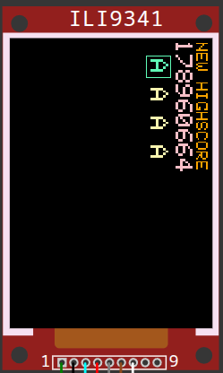

# Polybar Arcade

A Raspberry Pi Pico W arcade controller and game collection built with C++, PlatformIO, and Wokwi.

Polybar Arcade combines five illuminated fret buttons, a two-direction strum control, two buzzers, and a TFT display. The current firmware includes menu navigation, multiple difficulty levels, top-four leaderboards, four-character player initials, startup light and sound effects, and four game modes.



## Current games

- **Speedtest**: follow accelerating light and sound cues.
- **Simon Says**: repeat an increasingly long sequence of fret and strum inputs.
- **Reaction**: respond to a visual or audio cue as quickly as possible.
- **Solo Jam**: play minor, major, and blues note layouts.

## Current features

- Five fret buttons and matching LEDs
- Strum up/down input with two dedicated LEDs
- Two buzzers for notes and effects
- ILI9341 display in the Wokwi simulation
- 160 x 80 interface layout for the planned compact TFT
- Normal and no-light score categories
- Top-four leaderboards per difficulty
- Four-character initials using printable ASCII characters
- Startup hardware test and blues-inspired boot melody
- Green + Orange held during startup to mute sound

## Project structure

```text
polybar-arcade/
├── platformio.ini
├── diagram.json
├── wokwi.toml
├── src/
│   └── main.cpp
└── docs/
    ├── index.html
    ├── style.css
    └── assets/
        └── polybar-arcade.png
```

## GPIO mapping

### Display

- GP17: TFT CS
- GP16: TFT D/C
- GP20: TFT reset
- GP19: TFT MOSI
- GP18: TFT SCK

### Fret controls

- GP1, GP3, GP5, GP7, GP9: fret buttons
- GP2, GP4, GP6, GP8, GP10: fret LEDs

### Strum controls

- GP27: strum up
- GP28: strum down
- GP22: strum-up LED
- GP21: strum-down LED

### Audio

- GP15: note buzzer
- GP26: effects buzzer

## Build with PlatformIO

1. Install Visual Studio Code and the PlatformIO extension.
2. Open this repository as a PlatformIO project.
3. Build the `pico` environment.
4. Run the project in Wokwi or upload it to compatible RP2040 hardware.

## Run in Wokwi

The repository includes `diagram.json` and `wokwi.toml`. Build the project first so Wokwi can load:

```text
.pio/build/pico/firmware.uf2
.pio/build/pico/firmware.elf
```

## Roadmap

- Persistent high scores in flash
- Joystick, whammy, Start, and Select inputs
- Additional rhythm and reaction games
- Refactoring the single source file into input, display, sound, score, and game modules
- Final migration from the simulated ILI9341 to the planned 160 x 80 ST7735 display

## License

MIT License. See [LICENSE](LICENSE).
